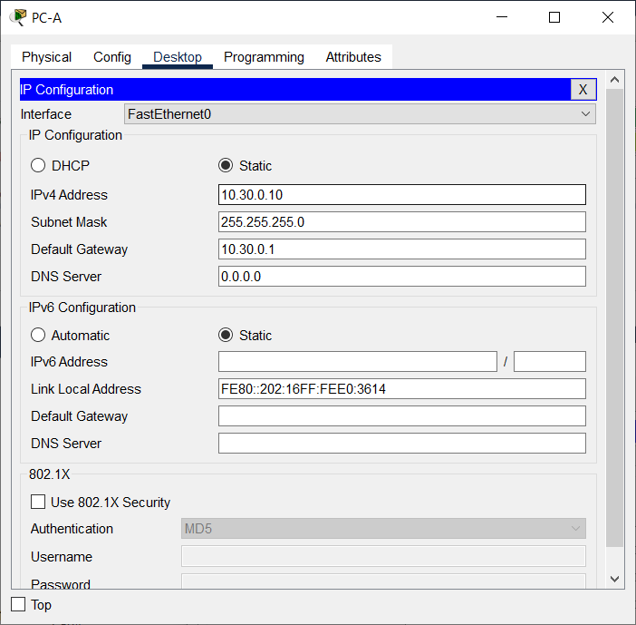
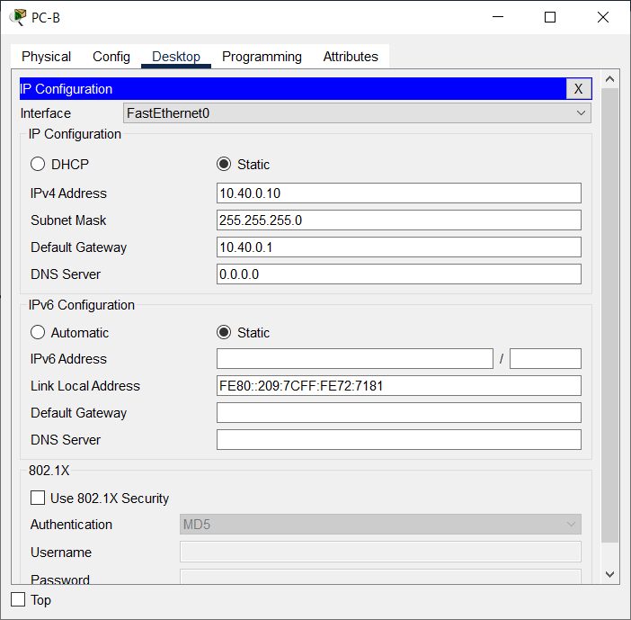
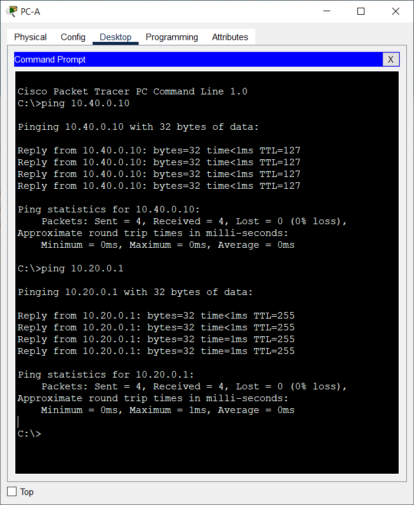
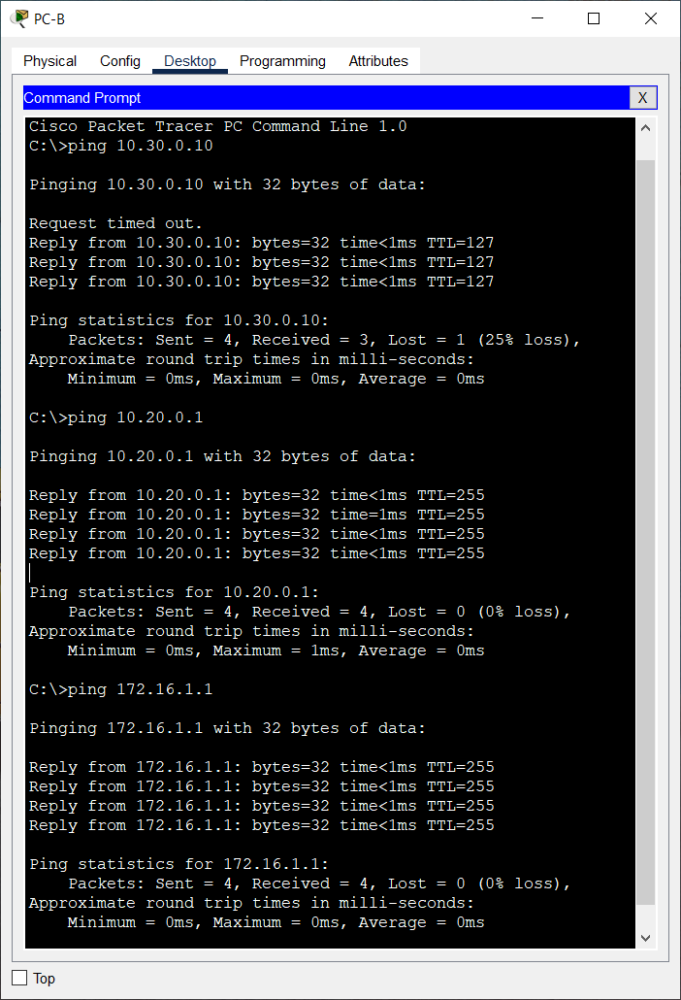
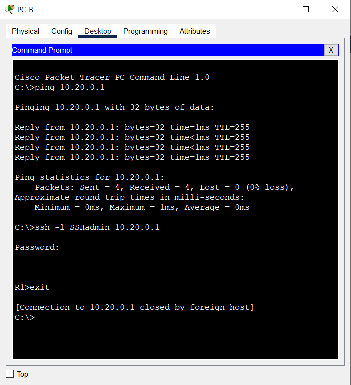
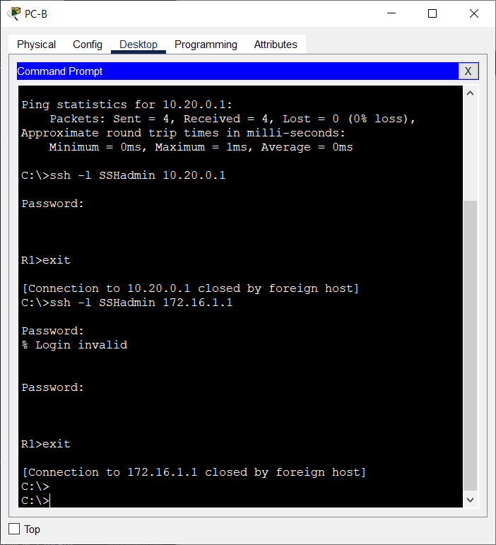
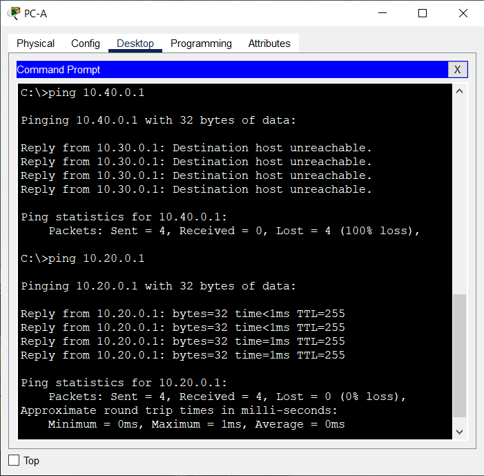
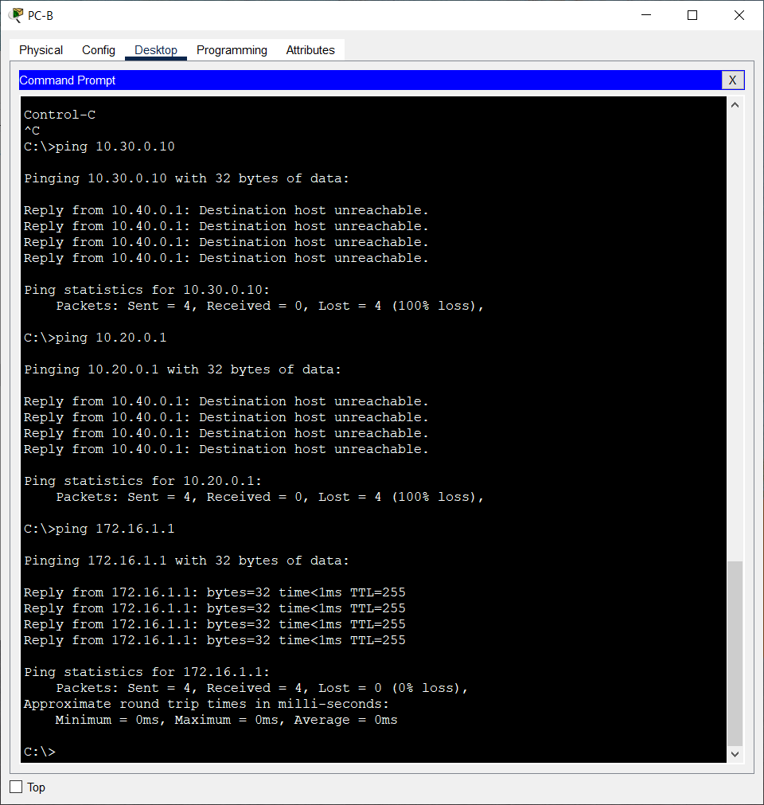
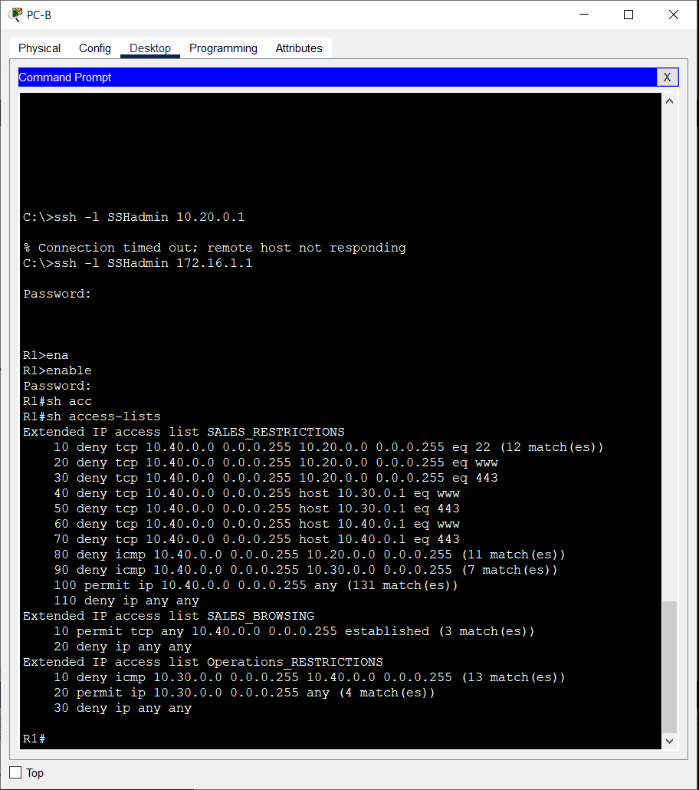

# Лабораторная работа. Настройка и проверка расширенных списков контроля доступа

# Задание
### [1. Создать сеть согласно топологии и произвести базовую настройку оборудования.](#1)
### [2. Настройка сетей VLAN на коммутаторах.](#2)
### [3. Настройка маршрутизации между сетями VLAN на R1.](#3)
### [4. Настройка все сетевые устройства для базовой поддержки SSH.](#4)
### [5. Проверка подключения.](#5)  
### [6. Настройка и проверка списков контроля доступа (ACL).](#6)  


## Таблица адресации

|Устройство | Интерфейс | IP-адрес          | Маска подсети   |Шлюз по умолчанию|
|-----------|-----------|-------------------|-----------------|-----------------|
|R1         |G0/0/1     |-                  | -               |-                |
|           |G0/0/1.20  |10.20.0.1          | 255.255.255.0   |-                |
|           |G0/0/1.30  |10.30.0.1          | 255.255.255.0   |-                |
|           |G0/0/1.40  |10.40.0.1          | 255.255.255.0   |-                |
|           |G0/0/1.1000|-                  | -               |-                |
|           |Loopback 1 |172.16.1.1         | 255.255.255.0   |-                |
|R2         |G0/0/1     |10.20.0.4          | 255.255.255.0   |-                |
|S1         |VLAN 20    |10.20.0.2          | 255.255.255.0   | 10.20.0.1       |
|S2         |VLAN 20    |10.20.0.3          | 255.255.255.0   | 10.20.0.1       |
|PC-A       |NIC        |10.30.0.10         | 255.255.255.0   | 10.30.0.1       |
|PC-B       |NIC        |10.40.0.10         | 255.255.255.0   | 10.40.0.1       |

## Таблица VLAN

|VLAN       | ИМЯ       | Назначенный интерфейс                   |
|-----------|-----------|-----------------------------------------|
|20         |Management |S2: F0/5                                 |
|30         |Operations |S1: F0/6                                 |
|40         |Sales      |S2: F0/18                                |
|999        |ParkingLot |S1: F0/2-4, F0/7-24, G0/1-2              |
|           |           |S2: F0/2-4, F0/6-17, F0/19-24, G0/1-2    |
|1000       |MyNative   |-                                        |

## Цели

Часть 1. Создание сети и настройка основных параметров устройства <br>
Часть 2. Настройка и проверка списков расширенного контроля доступа

### Решение

### <a name="1"> 1. Создать сеть согласно топологии и произвести базовую настройку оборудования.</a>  

##### Создание сети

##### Сеть согласно топологии


##### Настройка и проверка основных параметров маршрутизаторров

```
enable
configure terminal
no ip domain-lookup
enable secret class
line console 0
password cisco
login
line vty 0 4
password cisco
login
service password-encryption
hostname R1
copy running-config startup-config 
```
##### Настройка и проверка основных параметров коммутаторов

```
enable
configure terminal
no ip domain-lookup
enable secret class
line console 0
password cisco
login
line vty 0 4
password cisco
login
service password-encryption
hostname S1
copy running-config startup-config 
```

### <a name="2"> 2. Настройка сетей VLAN на коммутаторах.</a> 

##### Создание сети VLAN на коммутаторах

Создадим необходимые VLAN и назовал их на каждом коммутаторе из приведенной выше таблицы

     S1(config)#vlan 20
     S1(config-vlan)#name Management
     S1(config-vlan)#vlan 30
     S1(config-vlan)#name Operations
     S1(config-vlan)#vlan 40
     S1(config-vlan)#name Sales
     S1(config-vlan)#vlan 999
     S1(config-vlan)#name ParkingLot
     S1(config-vlan)#vlan 1000
     S1(config-vlan)#name MyNativeVlan

Настроим интерфейс управления и шлюз по умолчанию на каждом коммутаторе, используя информацию об IP-адресе в таблице адресации.

     S1(config)#interface vlan 20
     S1(config-if)#ip address 10.20.0.2 255.255.255.0
     S1(config)#ip default-gateway 10.20.0.1

     S2(config)#interface vlan 20
     S2(config-if)#ip address 10.20.0.3 255.255.255.0
     S2(config)#ip default-gateway 10.20.0.1

Назначим все неиспользуемые порты коммутаторов в VLAN **Parking Lot**, настроим их для статического режима доступа и административно деактивируем их.

     S1(config)#int range F0/2-4, F0/7-24, G0/1-2
     S1(config-if-range)#switchport mode access 
     S1(config-if-range)#switchport access vlan 999
     S1(config-if-range)#shutdown 

     S2(config)#interface range F0/2-4, F0/6-17, F0/19-24, G0/1-2
     S2(config-if-range)#switchport mode access 
     S2(config-if-range)#sw ac vl 999
     S2(config-if-range)#shut

##### Назначение сети VLAN соответствующим интерфейсам коммутатора

Назначим используемые порты соответствующей VLAN (указанной в таблице VLAN выше) и настроим их для режима статического доступа.

     S1(config)#int f0/6
     S1(config-if)#sw mo ac
     S1(config-if)#sw ac vl 30

     S2(config)#interface f0/5
     S2(config-if)#sw mo ac
     S2(config-if)#sw ac vl 20
     S2(config)#int f0/18
     S2(config-if)#sw mo ac
     S2(config-if)#sw ac vl 40

Выполним команду **show vlan brief**, чтобы убедиться, что сети VLAN назначены правильным интерфейсам.

     S1#sh vl br

     VLAN Name                             Status    Ports
     ---- -------------------------------- --------- -------------------------------
     1    default                          active    Fa0/1, Fa0/5
     20   Management                       active    
     30   Operations                       active    Fa0/6
     40   Sales                            active    
     999  ParkingLot                       active    Fa0/2, Fa0/3, Fa0/4, Fa0/7
                                                     Fa0/8, Fa0/9, Fa0/10, Fa0/11
                                                     Fa0/12, Fa0/13, Fa0/14, Fa0/15
                                                     Fa0/16, Fa0/17, Fa0/18, Fa0/19
                                                     Fa0/20, Fa0/21, Fa0/22, Fa0/23
                                                     Fa0/24, Gig0/1, Gig0/2
     1000 MyNativeVlan                     active    
     1002 fddi-default                     active    
     1003 token-ring-default               active    
     1004 fddinet-default                  active    
     1005 trnet-default                    active    

     S2#sh vl br

     VLAN Name                             Status    Ports
     ---- -------------------------------- --------- -------------------------------
     1    default                          active    Fa0/1
     20   Management                       active    Fa0/5
     30   Operations                       active    
     40   Sales                            active    Fa0/18
     999  ParkingLot                       active    Fa0/2, Fa0/3, Fa0/4, Fa0/6
                                                     Fa0/7, Fa0/8, Fa0/9, Fa0/10
                                                     Fa0/11, Fa0/12, Fa0/13, Fa0/14
                                                     Fa0/15, Fa0/16, Fa0/17, Fa0/19
                                                     Fa0/20, Fa0/21, Fa0/22, Fa0/23
                                                     Fa0/24, Gig0/1, Gig0/2
     1000 MyNativeVlan                     active    
     1002 fddi-default                     active    
     1003 token-ring-default               active    
     1004 fddinet-default                  active    
     1005 trnet-default                    active 

#### Часть 3. Настройка транков (магистральные каналы)

##### Вручную настроим магистральный интерфейс F0/1

Изменим режим порта коммутатора на интерфейсе **F0/1**, чтобы принудительно создать магистральную связь. Естественно сделаем это на обоих коммутаторах.

     S1(config)#int f0/1
     S1(config-if)#sw mo trunk 

В рамках конфигурации транка установим для **native vlan** значение **1000** на обоих коммутаторах.

     S1(config-if)#sw tr nat vl 1000

В качестве другой части конфигурации транка укажем, что VLAN 20, 30, 40 и 1000 разрешены в транке.

     S1(config-if)#sw tr all vl 20,30,40,1000

Выполним на обоих коммутаторах команду **show interfaces trunk** для проверки портов магистрали, собственной VLAN и разрешенных VLAN через магистраль.

     S1#sh interfaces trunk 
     Port        Mode         Encapsulation  Status        Native vlan
     Fa0/1       on           802.1q         trunking      1000

     Port        Vlans allowed on trunk
     Fa0/1       20,30,40,1000

     Port        Vlans allowed and active in management domain
     Fa0/1       20,30,40,1000

     Port        Vlans in spanning tree forwarding state and not pruned
     Fa0/1       none

##### Ручная настройка магистрального интерфейса F0/5 на коммутаторе S1

Настроим интерфейс **F0/5** на коммутаторе **S1** с теми же параметрами транка, что и **F0/1**.

     S1(config)#int fa0/5
     S1(config-if)#sw mo tr
     S1(config-if)#sw tr nat vl 1000
     S1(config-if)#sw tr all vl 20,30,40,1000

Проверим настройки используя команду **show interface fastEthernet 0/5 switchport**

     S1#show interface fastEthernet 0/5 switchport 
     Name: Fa0/5
     Switchport: Enabled
     Administrative Mode: trunk
     Operational Mode: down
     Administrative Trunking Encapsulation: dot1q
     Operational Trunking Encapsulation: dot1q
     Negotiation of Trunking: On
     Access Mode VLAN: 1 (default)
     Trunking Native Mode VLAN: 1000 (MyNativeVlan)
     Voice VLAN: none
     Administrative private-vlan host-association: none
     Administrative private-vlan mapping: none
     Administrative private-vlan trunk native VLAN: none
     Administrative private-vlan trunk encapsulation: dot1q
     Administrative private-vlan trunk normal VLANs: none
     Administrative private-vlan trunk private VLANs: none
     Operational private-vlan: none
     Trunking VLANs Enabled: 20,30,40,1000
     Pruning VLANs Enabled: 2-1001
     Capture Mode Disabled
     Capture VLANs Allowed: ALL
     Protected: false
     Unknown unicast blocked: disabled
     Unknown multicast blocked: disabled
     Appliance trust: none


### <a name="3"> 3. Настройка маршрутизации между сетями VLAN на R1.</a>  

##### Настройка маршрутизации между сетями VLAN на R1

Активируем интерфейс G0/0/1 на маршрутизаторе.

     R1(config)#int g0/0/1
     R1(config-if)#no shutdown 

После этой операции проверим настройки транка на коммутаторе **S1**

     S1#show interfaces trunk 
     Port        Mode         Encapsulation  Status        Native vlan
     Fa0/1       on           802.1q         trunking      1000
     Fa0/5       on           802.1q         trunking      1000

     Port        Vlans allowed on trunk
     Fa0/1       20,30,40,1000
     Fa0/5       20,30,40,1000

     Port        Vlans allowed and active in management domain
     Fa0/1       20,30,40,1000
     Fa0/5       20,30,40,1000

     Port        Vlans in spanning tree forwarding state and not pruned
     Fa0/1       20,30,40,1000
     Fa0/5       20,30,40,1000

Настроим подинтерфейсы для каждой VLAN, как указано в таблице IP-адресации. Все подинтерфейсы используют инкапсуляцию 802.1Q. Включим описание для каждого подинтерфейса.

     R1(config)#interface g0/0/1.20
     R1(config-subif)#encapsulation dot1Q 20
     R1(config-subif)#description Management
     R1(config-subif)#ip address 10.20.0.1 255.255.255.0
     R1(config-subif)#no shutdown

     R1(config-subif)#int g0/0/1.30
     R1(config-subif)#encapsulation dot1Q 30
     R1(config-subif)#description Operations
     R1(config-subif)#ip address 10.30.0.1 255.255.255.0
     R1(config-subif)#int g0/0/1.40
     R1(config-subif)#encapsulation dot1Q 40
     R1(config-subif)#description Sales
     R1(config-subif)#ip address 10.40.0.1 255.255.255.0

     R1(config-subif)#int g0/0/1.1000
     R1(config-subif)#encapsulation dot1Q 1000 native 
     R1(config-subif)#description MyNativeVlan

Убедимся, что подинтерфейс для собственной VLAN не имеет назначенного IP-адреса.

     R1#sh ip interface brief 
     Interface                     IP-Address      OK?      Method    Status                Protocol 
     GigabitEthernet0/0/1.1000     unassigned      YES      unset     up                    up 

Настроим интерфейс **Loopback 1** на **R1** с адресацией из приведенной выше таблицы.

     R1(config)#int Loopback 1
     R1(config-if)#ip address 172.16.1.1 255.255.255.0

С помощью команды **show ip interface brief** проверьте конфигурацию подинтерфейса.

     R1#sh ip interface brief 
     Interface                     IP-Address      OK? Method Status                Protocol 
     GigabitEthernet0/0/0          unassigned      YES unset  administratively down down 
     GigabitEthernet0/0/1          unassigned      YES unset  up                    up 
     GigabitEthernet0/0/1.20       10.20.0.1       YES manual up                    up 
     GigabitEthernet0/0/1.30       10.30.0.1       YES manual up                    up 
     GigabitEthernet0/0/1.40       10.40.0.1       YES manual up                    up 
     GigabitEthernet0/0/1.1000     unassigned      YES unset  up                    up 
     Loopback1                     172.16.1.1      YES manual up                    up 
     Vlan1                         unassigned      YES unset  administratively down down

##### Настройка интерфейса G0/0/1 на R2

Для настройки используем адрес из таблицы и установим маршрут по умолчанию с адресом следующего перехода 10.20.0.1

     R2(config)#int g0/0/1
     R2(config-if)#ip address 10.20.0.4 255.255.255.0
     R2(config-if)#exit
     R2(config)#ip route 0.0.0.0 0.0.0.0 10.20.0.1

### <a name="4"> 4. Настройка всех сетевые устройства для базовой поддержки SSH.</a>  

##### Настройка всех сетевых устройств для базовой поддержки SSH

Создадим локального пользователя с именем пользователя **SSHadmin** и зашифрованным паролем **$cisco123!**

     S*(config)#username SSHadmin password $cisco123!

Установим **ccna-lab.com** в качестве доменного имени.
```
 S*(config)#ip domain-name ccna-lab.com
```
Сгенерируем криптоключи с помощью 1024 битного модуля.

     S*(config)#crypto key generate rsa general-keys modulus 1024

Настроим первые пять линий VTY на каждом устройстве, чтобы поддерживать только SSH-соединения и с локальной аутентификацией.

     S*(config)#line vty 0 4
     S*(config-line)#login local 
     S*(config-line)#transport input ssh 

Включим доступ по протоколу SSH версии 2.

     S*(config)#ip ssh version 2

##### Включение защищенных веб-служб с проверкой подлинности на R1

**Выполнение данных команд в рамках CiscoPacketTracer невозможно**
```
     a. Включите сервер HTTPS на R1.

          R1(config)# ip http secure-server 

     b.   Настройте R1 для проверки подлинности пользователей, пытающихся подключиться к веб-серверу.

          R1(config)# ip http authentication local
```
### <a name="5"> 5. Проверка подключения.</a>  

##### Настройка узлов ПК

Адреса ПК возьмём в таблице адресации.



##### Выполнение тестов

|    От        |    Протокол  |    Назначение     |    Результат |
|--------------|--------------|-------------------|--------------|
|PC-A          |    Ping      |    10.40.0.10     |    OK        |
|PC-A          |    Ping      |    10.20.0.1      |    OK        |
|PC-B          |    Ping      |    10.30.0.10     |    OK        |
|PC-B          |    Ping      |    10.20.0.1      |    OK        |
|PC-B          |    Ping      |    172.16.1.1     |    OK        |
|PC-B          |    HTTPS     |    10.20.0.1      |    FAIL      |
|PC-B          |    HTTPS     |    172.16.1.1     |    FAIL      |
|PC-B          |    SSH       |    10.20.0.1      |    OK        |
|PC-B          |    SSH       |    172.16.1.1     |    OK        |

Причина **FAIL** на запросах по протоколу **HTTPS** связана с ограничениями CiscoPacketTracer

Результат выполнения команды **ping** с **PC-A**


Результат выполнения команды **ping** с **PC-B**


Результат выполнения команды **ssh** с **PC-B** на 10.20.0.1


Результат выполнения команды **ssh** с **PC-B** на 172.16.1.1


### <a name="6"> 6. Настройка и проверка списков контроля доступа (ACL).</a>  

При проверке базового подключения компания требует реализации следующих политик безопасности:
**Политика 1.** Сеть **Sales** не может использовать **SSH** в сети **Management** (но в  другие сети SSH разрешен).
**Политика 2.** Сеть **Sales** не имеет доступа к IP-адресам в сети **Management** с помощью любого веб-протокола (HTTP/HTTPS). Сеть **Sales** также не имеет доступа к интерфейсам R1 с помощью любого веб-протокола. Разрешён весь другой веб-трафик (обратите внимание — Сеть **Sales**  может получить доступ к интерфейсу Loopback 1 на R1).
**Политика 3**. Сеть **Sales** не может отправлять эхо-запросы **ICMP** в сети **Operations** или **Management**. Разрешены эхо-запросы ICMP к другим адресатам.
**Политика 4**: Cеть **Operations** не может отправлять **ICMP** эхозапросы в сеть **Sales**. Разрешены эхо-запросы ICMP к другим адресатам.

##### Проанализируем требования к сети и политике безопасности для планирования реализации ACL

Изучим заданные политики безопасности и перейдем к разработке и применению ACL.

##### Разработка и применение расширенных списков доступа, которые будут соответствовать требованиям политики безопасности

Для сети **Sales** создадим одно правило:

     ip access-list extended SALES_RESTRICTIONS
     Remark Deny Sales_netw access to SSH in Management_netw
     deny tcp 10.40.0.0 0.0.0.255 10.20.0.0 0.0.0.255 eq 22

     Remark Deny Sales_netw access to Management_netw 
     deny tcp 10.40.0.0 0.0.0.255 10.20.0.0 0.0.0.255 eq 80
     deny tcp 10.40.0.0 0.0.0.255 10.20.0.0 0.0.0.255 eq 443

     Remark Deny Sales_netw access to R1 intrefaces
     deny tcp 10.40.0.0 0.0.0.255 host 10.30.0.1 eq 80
     deny tcp 10.40.0.0 0.0.0.255 host 10.30.0.1 eq 443
     deny tcp 10.40.0.0 0.0.0.255 host 10.40.0.1 eq 80
     deny tcp 10.40.0.0 0.0.0.255 host 10.40.0.1 eq 443

     Remark Deny Sales_netw ICMP in Management_netw
     deny icmp 10.40.0.0 0.0.0.255 10.20.0.0 0.0.0.255

     Remark Deny Sales_netw ICMP in Operations_netw
     deny icmp 10.40.0.0 0.0.0.255 10.30.0.0 0.0.0.255

     Remark Permit Sales_netw all other 
     permit ip 10.40.0.0 0.0.0.255 any

     Remark Deny for counters
     deny ip any any

     exit

     ip access-list extended SALES_BROWSING
     Remark Only permit returning HTTP and HTTPS traffic
     permit tcp any 10.40.0.0 0.0.0.255 established
     deny ip any any

И применим его на интерфейс **G0/0/1.40**

     interface g0/0/1.40
     ip access-group SALES_RESTRICTIONS in
     ip access-group SALES_BROWSING out
     end

Для реализации политики №4 создадим правило:

     ip access-list extended Operations_RESTRICTIONS
     Remark Deny ICMP Operations_netw in Sales_netw
     deny icmp 10.30.0.0 0.0.0.255 10.40.0.0 0.0.0.255

     permit ip 10.30.0.0 0.0.0.255 any
     deny ip any any
     exit

И применил его на интерфейс **G0/0/1.30**

     interface g0/0/1.30
     ip access-group Operations_RESTRICTIONS in
     end

##### Проверка, что политики безопасности применяются развернутыми списками доступа

Выполните следующие тесты. Ожидаемые результаты показаны в таблице:

|    От        |    Протокол  |    Назначение     |    Результат |
|--------------|--------------|-------------------|--------------|
|PC-A          |    Ping      |    10.40.0.10     |    FAIL      |
|PC-A          |    Ping      |    10.20.0.1      |    OK        |
|PC-B          |    Ping      |    10.30.0.10     |    FAIL      |
|PC-B          |    Ping      |    10.20.0.1      |    FAIL      |
|PC-B          |    Ping      |    172.16.1.1     |    OK        |
|PC-B          |    HTTPS     |    10.20.0.1      |    FAIL      |
|PC-B          |    HTTPS     |    172.16.1.1     |    FAIL      |
|PC-B          |    SSH       |    10.20.0.1      |    FAIL      |
|PC-B          |    SSH       |    172.16.1.1     |    OK        |






